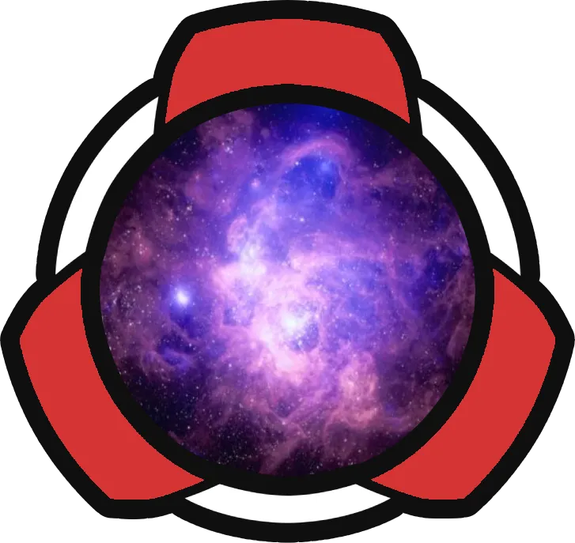

<h1 align="center">
   
  
   
  Starwards
   
   
</h1>

  
  

# What is this?

Starwards is a space and starship simulator designed specifically for LARPs (Live Action Role-Playing games). Derived from the "Starship Bridge Simulator" genre, Starwards is designed to support long games where the players interact with the ship's system throughout the ship, not just in the bridge.

# how to run and use it

Currently executables are being built in [circleci](https://app.circleci.com/pipelines/github/starwards/starwards?branch=master&filter=build&status=none&status=success) after every change. download and run the executable.

This is not a solution we like. We are [open to improvements and suggestions](https://github.com/starwards/starwards/issues/832).

# how do I get involved

Starwards is a labour of love built by enthusiastic volunteers. We eagerly welcome anyone who would like to join us, so long as they adhere to our [code of conduct](CODE_OF_CONDUCT.md).

Please report any code of conduct violations to [greenshade@gmail.com](mailto:greenshade@gmail.com)

To get started, you can:

1. Take a look at the "Issues" in this repository - especially those marked "Good first issue". Those with the "Help Wanted" tag probably don't have anyone else working on them.
2. Drop by our [chat](https://discord.gg/p56nSVEjdb) and ask what you can work on, or how to get started.
3. Open an issue with your idea(s) for the project or tell us about them in our chat.

## How do I contribute?

Please read [Contributing to Starwards](CONTRIBUTING.md) for more details.

## License

`SPDX-License-Identifier: AGPL-3.0-or-later`
For more details on license and copyright see [the license file](LICENSE.md)

The current license was chosen because we feel it best represents the ethics of knowledge sharing if the LARP community. If you feel that we should consider changing the license, please contact us on our [chat](https://discord.gg/p56nSVEjdb).
