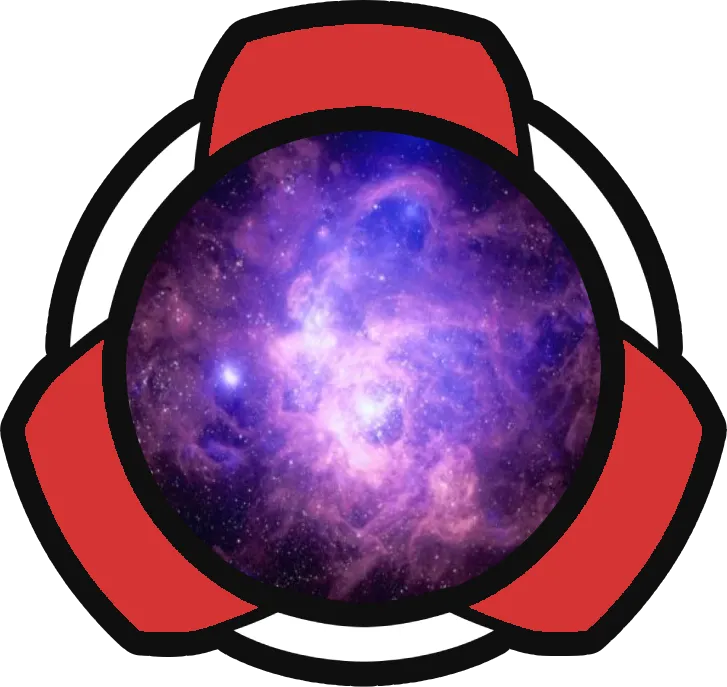

<h1 align="center">
  <br>
  
  <br>
  Starwards
  <br>
  <br>
</h1>

<p align="center">
  <a href="https://discord.gg/p56nSVEjdb"></a>
  <a href="https://github.com/starwards/starwards/actions/workflows/ci-cd.yml?query=branch%3Amaster"></a>

<video src='https://user-images.githubusercontent.com/6019373/178277941-01a61ddb-c6cb-4620-b5aa-966291710d69.mp4' width=180/>
</p>


# Background

Starwards emerged from years of extending EmptyEpsilon for space LARPs (2016-2021). After extensive modifications and a productive fork, we hit fundamental limitations - EmptyEpsilon was designed for short sessions, not the lengthy LARP events we run. We decided to build Starwards from scratch as a platform designed specifically for LARP needs.

# What is this?

Starwards is a space and starship simulator designed specifically for LARPs (Live Action Role-Playing games). Derived from the "Starship Bridge Simulator" genre, Starwards is designed to support long games where the players interact with the ship's system throughout the ship, not just in the bridge.

# Download & run

Latest development build (may be unstable): [starwards.exe](https://github.com/starwards/starwards/releases/download/master-latest/starwards.exe)

1. Go to the [Releases page](https://github.com/starwards/starwards/releases) and download `starwards.exe` from the latest release (Windows only).
2. Run `starwards.exe` - it starts the game server on port 8080 and opens the lobby in your default browser (set `STARWARDS_NO_OPEN=1` to skip this).
3. If it didn't open automatically, go to [http://localhost:8080](http://localhost:8080) yourself. The lobby's "Connect other devices" panel shows a QR code for each address on your network — scan one from a phone on the same Wi-Fi to open a station screen there.

Testing this build for us? See the [reviewer guide](docs/REVIEWING.md) for a suggested run script and how to send feedback.

If you'd rather build from source, see [developing](#developing) below - `npm run build && npm run pkg` produces the same executable at `dist/exec/starwards-win.exe` (plus a Linux build at `dist/exec/starwards-linux`).

# developing

```sh
npm ci          # install dependencies
npm run dev     # core watch + game server + web dev server, one terminal
```

Then open [http://localhost:3000](http://localhost:3000). See [Contributing to Starwards](CONTRIBUTING.md) for the full setup, [docs/DEVELOPMENT.md](docs/DEVELOPMENT.md) for build/test workflows, and the [docs index](docs/) for architecture and design references.

### the game is running! now what?
Missing documentation. contributions are welcomed!

In the "GM" and "empty" screen, the list to the left represents UI widgets that can be *dragged into the main screen*. so you build your own screen. this way each game can have their stations set up the way they want to. later we will support saving the screen presets.

https://blog.starwards.space/2021-03-06-modular-peek/

# how do I get involved

Starwards is a labour of love built by enthusiastic volunteers. We eagerly welcome anyone who would like to join us, so long as they adhere to our [code of conduct](CODE_OF_CONDUCT.md).

Please report any code of conduct violations to [greenshade@gmail.com](mailto:greenshade@gmail.com)

To get started, you can:

1. Take a look at the "Issues" in this repository - especially those marked "Good first issue". Those with the "Help Wanted" tag probably don't have anyone else working on them.
2. Drop by our [chat](https://discord.gg/p56nSVEjdb) and ask what you can work on, or how to get started.
3. Open an issue with your idea(s) for the project or tell us about them in our chat.
4. Read our [developers blog](https://blog.starwards.space/)

## How do I contribute?

Please read [Contributing to Starwards](CONTRIBUTING.md) for more details.

## License

`SPDX-License-Identifier: AGPL-3.0-or-later`

For more details on license and copyright see [the license file](LICENSE.md)

The current license was chosen because we feel it best represents the ethics of knowledge sharing in the LARP community. If you feel that we should consider changing the license, please contact us on our [chat](https://discord.gg/p56nSVEjdb).
