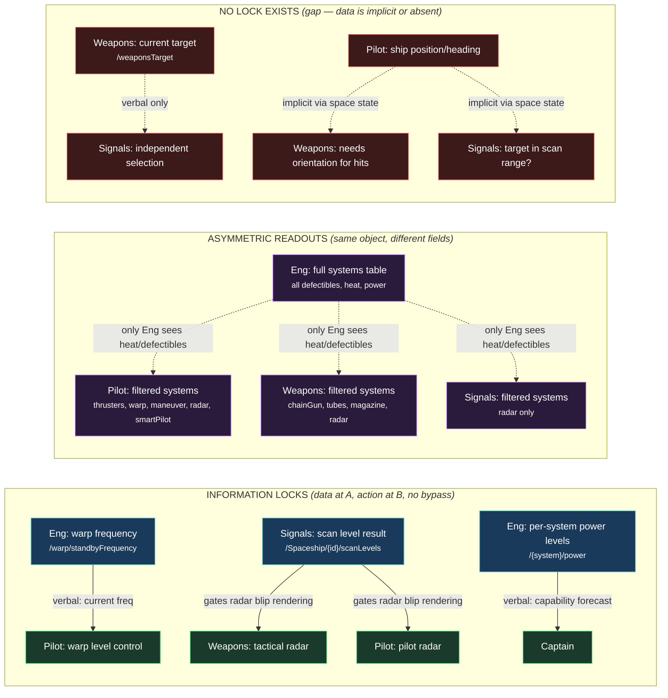
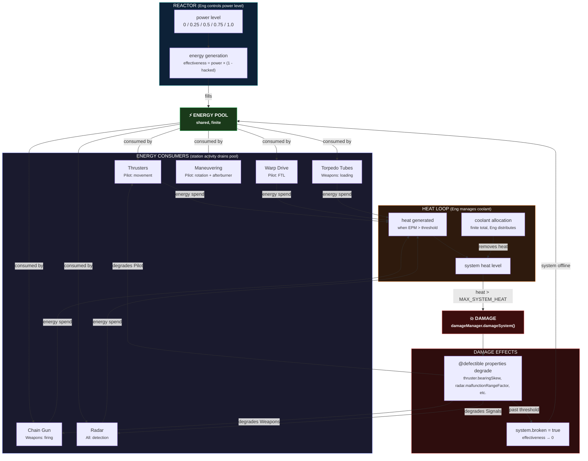
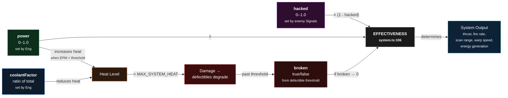
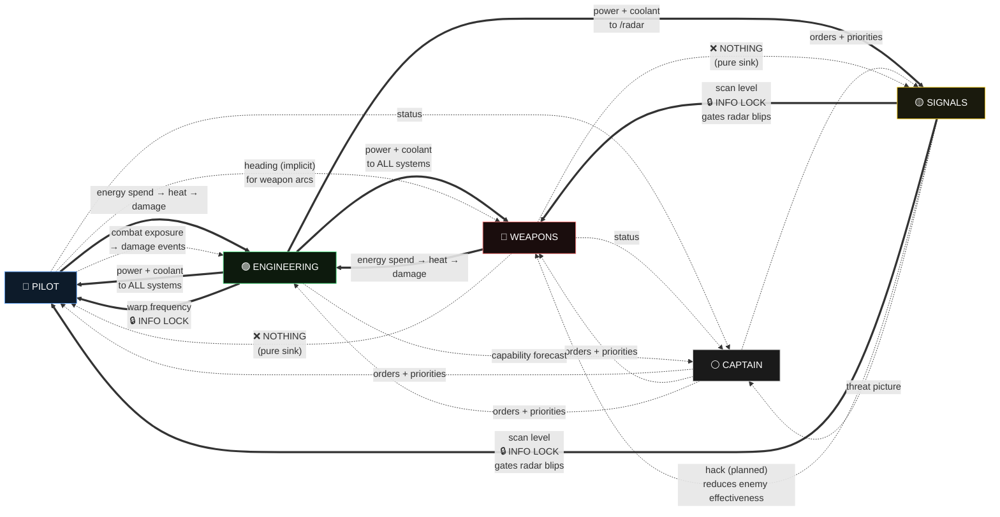
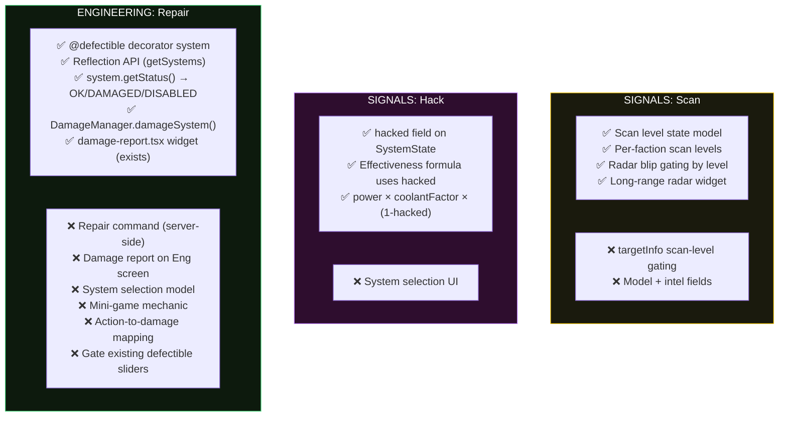

# Bridge Dynamics — Visual Reference

Four stations (Pilot, Weapons, Bridge Engineering, Signals) + floating Captain.
Diagrams use the comms-forcing pattern vocabulary from the research dossier.

---

## 1. Information Locks & Verbal Handoffs

What data lives at exactly one station and is needed by another.
Solid lines = mechanically enforced (code). Dashed = verbal/implicit only.

---

## 2. Resource Flow (Energy → Heat → Damage Loop)

The mechanical engine that couples all stations.

---

## 3. Per-Station Action Loops & Cross-Station Dependencies

Each station's core loop and what it needs from / supplies to others.

```mermaid
flowchart TB
    subgraph PILOT ["🔵 PILOT"]
        direction TB
        P1["fly ship<br/><small>rotation, strafe, boost</small>"]
        P2["manage warp<br/><small>level up/down</small>"]
        P3["dock/undock"]
        P4["read pilot radar"]
    end

    subgraph WEAPONS ["🔴 WEAPONS"]
        direction TB
        W1["select & cycle targets<br/><small>filters: ship/enemy/short-range</small>"]
        W2["fire chain gun"]
        W3["load & fire torpedoes<br/><small>select ammo type</small>"]
        W4["read tactical radar<br/><small>5000m range</small>"]
    end

    subgraph ENGINEERING ["🟢 ENGINEERING"]
        direction TB
        E1["allocate power per system<br/><small>0 / 0.25 / 0.5 / 0.75 / 1.0</small>"]
        E2["allocate coolant per system<br/><small>finite total pool</small>"]
        E3["monitor full systems table<br/><small>status, heat, defectibles</small>"]
        E4["⬜ repair damaged systems<br/><small>NOT YET BUILT — mini-game TBD</small>"]
        E5["set warp frequency"]
    end

    subgraph SIGNALS ["🟡 SIGNALS"]
        direction TB
        S1["long-range radar<br/><small>50km default, up to 250km</small>"]
        S2["select targets independently<br/><small>own SelectionContainer</small>"]
        S3["🟡 scan targets<br/><small>mechanics built server-side; station UI for queuing jobs TBD</small>"]
        S4["🟡 hack enemy systems<br/><small>mechanics built server-side; station UI for queuing jobs TBD</small>"]
    end

    subgraph CAPTAIN ["⚪ CAPTAIN <small>(no UI, no controls)</small>"]
        direction TB
        Cap1["set priorities<br/><small>objective vs survival vs intel</small>"]
        Cap2["route decisions<br/><small>who does what when</small>"]
        Cap3["manage comms noise<br/><small>filter signal from chatter</small>"]
    end

    %% DEPENDENCIES: who needs whom

    %% Engineering → Everyone (power/coolant)
    E1 ==>|"⚡ power level"| P1
    E1 ==>|"⚡ power level"| W2
    E1 ==>|"⚡ power level"| W3
    E1 ==>|"⚡ power level"| S1
    E2 ==>|"❄️ coolant"| P1
    E2 ==>|"❄️ coolant"| W2
    E2 ==>|"❄️ coolant"| S1

    %% Engineering → Pilot (warp freq)
    E5 -->|"🔒 INFO LOCK<br/>verbal only"| P2

    %% Pilot → Weapons (orientation)
    P1 -->|"ship heading<br/><small>implicit</small>"| W4

    %% Signals → Weapons/Pilot (scan intel)
    S3 -.->|"🔒 INFO LOCK<br/>scan level gates blips"| W4
    S3 -.->|"🔒 INFO LOCK<br/>scan level gates blips"| P4

    %% Signals → Weapons (hack)
    S4 -.->|"softened target<br/><small>hacked field reduces effectiveness</small>"| W1

    %% Pilot/Weapons → Engineering (damage + heat)
    P1 -->|"energy spend → heat"| E3
    W2 -->|"energy spend → heat"| E3
    W3 -->|"energy spend → heat"| E3

    %% Combat → Engineering (damage)
    W4 -->|"combat exposure → damage"| E3

    %% Captain ↔ Everyone (verbal)
    Cap1 -.->|"orders"| P1
    Cap1 -.->|"orders"| W1
    Cap1 -.->|"orders"| E1
    Cap1 -.->|"orders"| S2
    E3 -.->|"status reports"| Cap2
    S1 -.->|"threat picture"| Cap2
    W4 -.->|"engagement status"| Cap2

    style PILOT fill:#0d1b2a,stroke:#60a5fa,color:#fff
    style WEAPONS fill:#1a0d0d,stroke:#f87171,color:#fff
    style ENGINEERING fill:#0d1a0d,stroke:#4ade80,color:#fff
    style SIGNALS fill:#1a1a0d,stroke:#facc15,color:#fff
    style CAPTAIN fill:#1a1a1a,stroke:#d4d4d4,color:#fff
```

---

## 4. Comms-Forcing Pattern Coverage

Which patterns from the catalog are present, partial, or missing in the current Starwards bridge.

```mermaid
graph TD
    subgraph PRESENT ["✅ PATTERNS PRESENT IN CODE"]
        direction TB
        IL["<b>Information Lock</b><br/>Eng → Pilot: warp frequency<br/>Signals → All: scan level gates radar<br/>Eng → All: per-system power/coolant"]

        AR["<b>Asymmetric Readout</b><br/>systemsStatus filtered per station<br/>Eng sees full table + defectibles<br/>Others see own systems only"]

        CC["<b>Consoleless Coordinator</b><br/>Captain: no station, no UI<br/>derives role from partial views"]

        IV["<b>Internal-View Role</b><br/>Eng sees only systems table<br/>no radar, no contacts, no heading"]

        PRI["<b>Per-Role Input Modality</b><br/>Pilot: WASD + gamepad axes<br/>Weapons: target cycle + fire keys<br/>Eng: power/coolant hotkey pairs<br/>Signals: radar + selection"]
    end

    subgraph PARTIAL ["🟡 PATTERNS PARTIAL"]
        direction TB
        SD["<b>Scale Differential</b><br/>Signals: 50–250km long-range radar<br/>Weapons: 5km tactical radar<br/>Pilot: pilot radar<br/><i>⚠ No sector/strategic scale yet</i>"]

        CAC["<b>Cooperative Action Chain</b><br/>Warp sequence: Eng power → Eng freq → Pilot level<br/><i>⚠ Only 2 stations, short chain</i><br/><i>⚠ No 3+ station chains exist</i>"]

        RNH["<b>Recurrent Numerical Handoff</b><br/>Warp frequency is a number (W770–W810Hz)<br/><i>⚠ Rarely changes mid-session</i><br/><i>⚠ No per-encounter fresh number like EE's shield freq</i>"]
    end

    subgraph MISSING ["❌ PATTERNS MISSING"]
        direction TB
        FRT["<b>Forced Report Trigger</b><br/><i>No mechanical event forces a station</i><br/><i>to announce anything. Comms depend</i><br/><i>entirely on captain prompting or</i><br/><i>player initiative.</i>"]

        RLP["<b>Range-Limited Action by Proxy</b><br/><i>No action requires another station's</i><br/><i>positioning to be correct. Signals can</i><br/><i>scan anything on radar regardless of</i><br/><i>ship position.</i>"]

        SOLO["<b>Anti-pattern: Solo Minigame</b><br/><i>Risk: if scan/hack/repair mini-games</i><br/><i>are self-contained, they'll isolate the</i><br/><i>player. Design them with cross-station</i><br/><i>inputs (difficulty, data, timing).</i>"]
    end

    style PRESENT fill:#0d2e1a,stroke:#4ade80,color:#fff
    style PARTIAL fill:#2e2a0d,stroke:#facc15,color:#fff
    style MISSING fill:#2e0d0d,stroke:#f87171,color:#fff
```

---

## 5. The Effectiveness Formula Chain

How a single system's output is determined — the mechanical core that makes Engineering load-bearing.

---

## 6. Station Dependency Matrix (Directed Graph)

Every dependency in one view. Edge labels show what flows. Thick = strong (mechanical). Thin = weak (verbal/implicit).

---

## 7. What's Built vs. What's Missing (per mini-game pattern)

---

## Legend

| Symbol | Meaning |
|--------|---------|
| `==>` | Strong mechanical dependency (code-enforced) |
| `-->` | Mechanical flow (resource, state change) |
| `-.->` | Verbal / implicit / planned dependency |
| 🔒 | Information Lock pattern |
| ⬜ | Not yet built |
| ❌ | Missing / gap |
| ✅ | Present in code |
