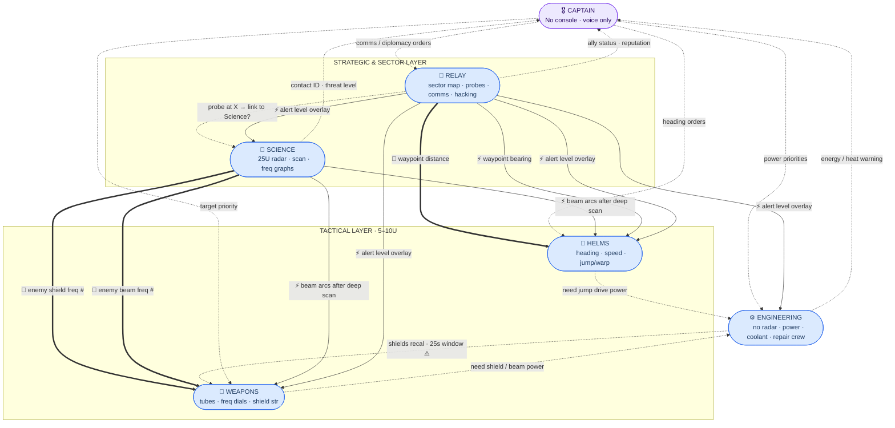
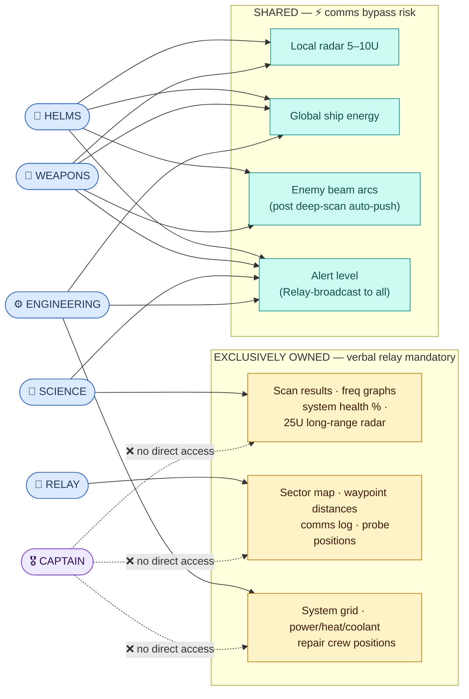
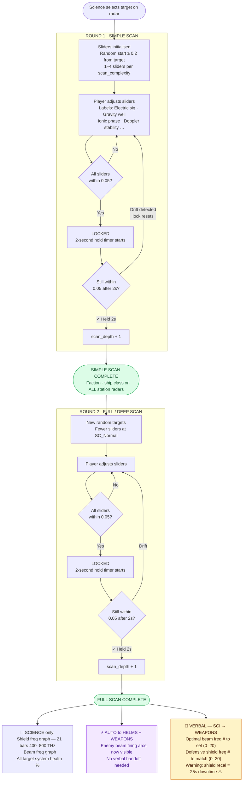
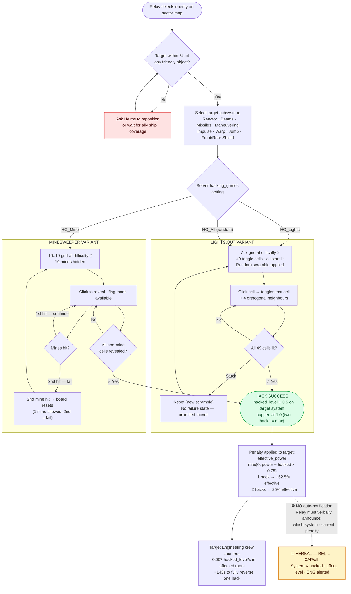
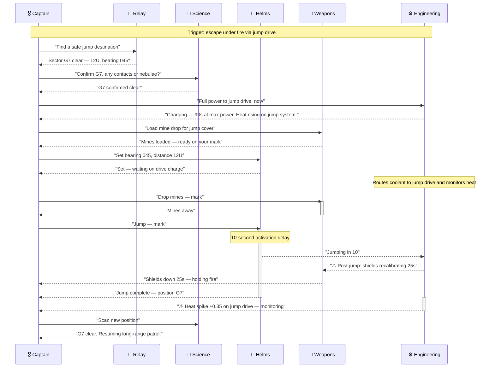

# EmptyEpsilon — Bridge Dynamics: Visual Reference
*Companion to the Mini-Game Mechanics and Roles & Communication dossiers.*

Seven Mermaid diagrams covering the full communication architecture, information ownership, all three core mini-game pipelines, a canonical cooperative action chain, and the complete comms-forcing pattern taxonomy with anti-patterns.

**Shared legend**

| Visual | Meaning |
|---|---|
| Thick edge `==>` | **Information Lock** — data at A, action knob at B, no bypass |
| Dashed edge `-.->` | Verbal communication required — no automatic bridge |
| Solid edge `-->` | Data auto-shared; no voice needed |
| ⚡ | Comms bypass / auto-pushed data (anti-pattern risk) |
| 🔐 | Information Lock pattern instance |
| ⚠ | Time-critical coordination window |
| ❌ | No access — station cannot see this data |
| ⛔ | Anti-pattern node |

---

## 1 · Bridge Communication Architecture

Every station, every communication edge. Thick `==>` = Information Lock; dashed = verbal required; solid = automatic.

---

## 2 · Information Domain Ownership

Which station exclusively owns each data domain (amber = forces verbal relay) versus which data is shared across multiple stations (teal = bypass risk). The Captain owns nothing and cannot self-service any domain.

---

## 3 · Science Scan Pipeline

Two-round slider mini-game. Each round: hold all sliders within 0.05 of their hidden targets for 2 continuous seconds. The downstream split at Full Scan shows what is auto-pushed vs. what requires verbal handoff.

---

## 4 · Relay Hacking Mini-Game

Both mini-game variants, the range requirement that creates a Helms dependency, and the downstream effect chain. Note the anti-pattern: no automatic notification to other stations on success.

---

## 5 · Engineering Power–Heat–Repair Loop

The continuous resource-management cycle. Engineering is radar-blind — all external context arrives as verbal orders (left side). The Relay hacking side-chain shows how the two stations interact through the repair crew.

```mermaid
flowchart LR
    subgraph IN["INPUTS (Engineering screen)"]
        PWR["Power slider
        0–300% per system
        9 systems total"]
        COOL["Coolant allocation
        0–10 units/system
        10 units shared pool"]
        CMD["⬅ VERBAL ONLY
        Captain / stations
        send combat context
        Engineering is radar-blind"]
    end

    subgraph HLOOP["HEAT LOOP"]
        DLT{"Heat delta
        = 1.7^(power−1)
        − (1.01 + coolant × 0.1)"}
        SAFE(["Delta ≤ 0
        System cooling ✓"])
        RISE(["Delta > 0
        Heat rising ⚠"])
        OVER["Heat reaches 1.0
        OVERHEAT
        −0.08 health/s"]
    end

    subgraph RLOOP["DAMAGE & REPAIR LOOP"]
        DMG["System health
        range: −1.0 to +1.0
        below 0 = inoperable"]
        CREW["Repair crew dispatched
        2 cells/s movement
        0.007 health/s repair
        ~143s for full restore"]
    end

    subgraph HKLOOP["RELAY HACKING CHAIN"]
        HKPEN["hacked_level +0.5/hack
        cap 1.0
        penalty: −hacked × 0.75 power"]
        UNHK["Crew un-hacks in parallel:
        0.007 hacked_level/s
        while in affected room"]
    end

    subgraph EFFOUT["EFFECTIVE OUTPUT"]
        EFF["System effectiveness
        = power × health − hacked × 0.75"]
        OUT(["Beam damage
        Shield regen
        Engine speed
        Jump charge rate"])
    end

    CMD --> PWR
    PWR --> DLT
    COOL --> DLT
    DLT --> SAFE & RISE
    RISE --> OVER
    OVER --> DMG
    SAFE --> EFF
    DMG --> CREW
    CREW --> DMG
    CREW --> UNHK
    UNHK --> HKPEN
    HKPEN --> EFF
    DMG --> EFF
    EFF --> OUT

    classDef good fill:#dcfce7,stroke:#16a34a,color:#14532d
    classDef warn fill:#fef9c3,stroke:#ca8a04,color:#422006
    classDef danger fill:#fee2e2,stroke:#dc2626,color:#450a0a
    class SAFE good
    class RISE warn
    class OVER danger
```

---

## 6 · Cooperative Action Chain — Jump Drive Escape

A canonical six-station sequential chain. Every station speaks; no station can act until the previous step is confirmed. This is the purest instance of the Cooperative Action Chain pattern in EE.

---

## 7 · Pattern Taxonomy and Anti-Patterns

Which EE mechanics implement which comms-forcing patterns (strong = mechanically enforced; weak = convention-dependent or partial), and which anti-patterns undermine them.

```mermaid
flowchart TD
    subgraph STRONG["STRONG — mechanically enforced"]
        P1["🔐 Information Lock"]
        P2["📊 Asymmetric Readout"]
        P3["🎖 Consoleless Coordinator"]
        P4["🗺 Scale Differential"]
        P5["🔢 Recurrent Numerical Handoff"]
        P6["🔲 Internal-View Role"]
        P7["🔗 Cooperative Action Chain"]
        P8["📍 Range-Limited by Proxy"]
    end

    subgraph WEAK["WEAK / PARTIAL — convention or incomplete"]
        P9["⚡ Forced Report Trigger
        Not implemented — convention only
        No mechanic compels announcements"]
        P10["🎮 Per-Role Input Modality
        Partial — scan sliders · hacking
        puzzles · repair crew floor plan"]
        P11["🎬 Live Authority for Narrative
        Strong — but in separate GM role
        not integrated into station design"]
    end

    subgraph MECH["EE MECHANICS"]
        M1["SCI → WPN freq handoff
        after every deep scan"]
        M2["REL bearing ≠ distance split
        SCI 25U vs HLM/WPN 5–10U"]
        M3["Captain: no console
        voice and main screen only"]
        M4["ENG: zero radar
        blind to all external events"]
        M5["3-tier radar scale
        ENG none / SCI 25U / REL sector"]
        M6["Freq # rerolls per enemy ship
        new handoff each combat"]
        M7["6-station jump escape chain
        REL → SCI → ENG → WPN → HLM"]
        M8["Hack range: 5U from any friendly
        Relay depends on Helms position"]
    end

    P1 --> M1
    P2 --> M2
    P3 --> M3
    P4 --> M5
    P5 --> M6
    P6 --> M4
    P7 --> M7
    P8 --> M8
    P1 & P5 --> M6

    subgraph AP["⛔ ANTI-PATTERNS"]
        AP1["⚡ Auto-pushed beam arcs
        SCI → HLM/WPN without Science
        announcing — cuts verbal handoff"]
        AP2["🧩 Hacking is a solo puzzle
        Relay solves alone, no Science
        dependency (GitHub #467 since 2017)"]
        AP3["🔀 Station merging
        Tactical = HLM+WPN
        Ops = SCI+REL
        kills dependencies it wraps"]
        AP4["👁 Convention-only silos
        Global energy on HLM+WPN+ENG
        screens — Engineering not unique"]
        AP5["😴 Flat workload cycles
        ENG / REL / SCI all idle during
        same lull phases simultaneously"]
    end

    AP1 -. "undermines" .-> P1
    AP1 -. "undermines" .-> P5
    AP2 -. "undermines" .-> P8
    AP3 -. "undermines" .-> P7
    AP3 -. "undermines" .-> P2
    AP4 -. "undermines" .-> P6
    AP4 -. "undermines" .-> P2
    AP5 -. "undermines" .-> P10

    classDef strong fill:#dbeafe,stroke:#2563eb,color:#1e3a5f
    classDef weak fill:#f0fdf4,stroke:#16a34a,color:#14532d
    classDef mech fill:#fef3c7,stroke:#d97706,color:#451a03
    classDef anti fill:#fee2e2,stroke:#dc2626,color:#450a0a
    class P1,P2,P3,P4,P5,P6,P7,P8 strong
    class P9,P10,P11 weak
    class M1,M2,M3,M4,M5,M6,M7,M8 mech
    class AP1,AP2,AP3,AP4,AP5 anti
```

