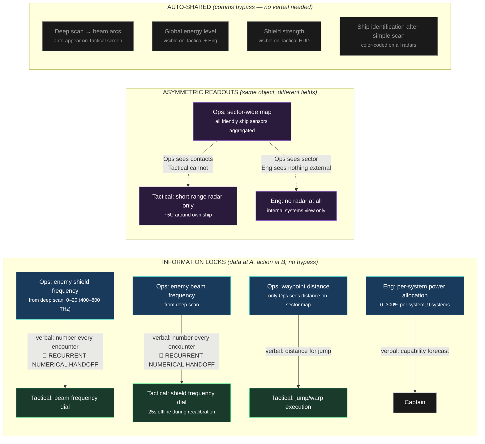
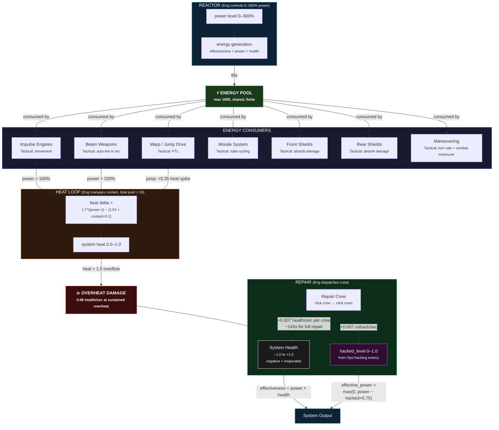
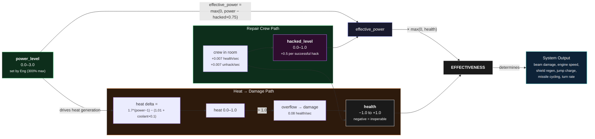
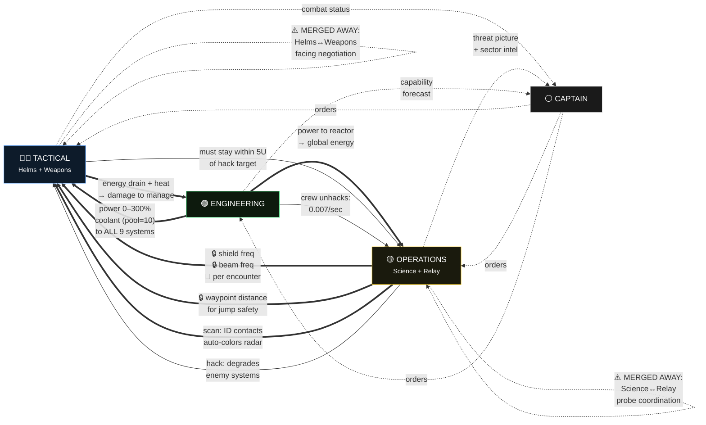

# EmptyEpsilon Bridge Dynamics — 4-Station Layout Visual Reference

EE's 4-player configuration: **Tactical** (Helms+Weapons merged), **Engineering**, **Operations** (Science+Relay merged), **Captain** (consoleless).

All mechanics from the EE source-code-verified research dossier.

---

## 1. Information Locks & Verbal Handoffs

---

## 2. Resource Flow (Energy → Heat → Damage Loop)

---

## 3. Per-Station Action Loops & Cross-Station Dependencies

```mermaid
flowchart TB
    subgraph TACTICAL ["🔵🔴 TACTICAL <small>(Helms + Weapons merged)</small>"]
        direction TB
        T1["fly ship<br/><small>impulse, heading, combat maneuver</small>"]
        T2["warp / jump drive"]
        T3["select targets on radar"]
        T4["fire beams <small>(auto in arc)</small>"]
        T5["load + fire missile tubes"]
        T6["set beam frequency dial"]
        T7["set shield frequency dial<br/><small>25s offline during change</small>"]
        T8["dock / undock"]
    end

    subgraph OPERATIONS ["🟡 OPERATIONS <small>(Science + Relay merged)</small>"]
        direction TB
        O1["long-range radar<br/><small>~25U radius</small>"]
        O2["simple scan<br/><small>slider mini-game: align N sliders<br/>within 0.05, hold 2s</small>"]
        O3["deep scan<br/><small>same mechanic, fewer sliders<br/>reveals frequencies + system health</small>"]
        O4["hack enemy system<br/><small>Lights Out 7×7 or Minesweeper 10×10<br/>select subsystem, solve puzzle</small>"]
        O5["launch probes<br/><small>up to 8, 10-min lifetime, 5U radius</small>"]
        O6["place waypoints<br/><small>bearing visible to all, distance only here</small>"]
        O7["comms with NPCs<br/><small>text menu, reputation cost</small>"]
        O8["link probe to own scan view"]
    end

    subgraph ENGINEERING ["🟢 ENGINEERING"]
        direction TB
        E1["power sliders per system<br/><small>0–300%, 9 systems, snap at 100%</small>"]
        E2["coolant sliders per system<br/><small>total pool = 10, zero-sum</small>"]
        E3["dispatch repair crew<br/><small>click crew → click room on ship map<br/>pathfinds through doors</small>"]
        E4["monitor system health + heat"]
        E5["self-destruct button"]
    end

    subgraph CAPTAIN ["⚪ CAPTAIN <small>(no console)</small>"]
        direction TB
        Cap1["main screen control<br/><small>rotate between views</small>"]
        Cap2["set priorities + doctrine"]
        Cap3["coordinate all stations"]
    end

    %% Ops → Tactical (frequency locks)
    O3 ==>|"🔒 shield freq number<br/>verbal every encounter"| T6
    O3 ==>|"🔒 beam freq number<br/>verbal every encounter"| T7
    O2 ==>|"scan reveals faction/type<br/>auto-colors all radars"| T3
    O3 ==>|"beam arcs auto-shared"| T1

    %% Ops → Tactical (waypoint distance)
    O6 ==>|"🔒 distance number<br/>verbal for jump safety"| T2

    %% Eng → Tactical (power)
    E1 ==>|"⚡ system effectiveness"| T1
    E1 ==>|"⚡ system effectiveness"| T4
    E1 ==>|"⚡ system effectiveness"| T5
    E1 ==>|"⚡ system effectiveness"| T2
    E2 ==>|"❄️ prevents overheat"| T1

    %% Eng → Ops (power to... nothing specific — Ops has no subsystem)
    E1 -.->|"⚡ power to reactor<br/><small>affects global energy</small>"| O1

    %% Tactical → Eng (demands)
    T1 -->|"energy drain + heat"| E4
    T4 -->|"energy drain + heat"| E4
    T5 -->|"energy drain"| E4
    T2 -->|"jump: heat spike + energy"| E4

    %% Ops → Eng (hacking results)
    O4 -->|"hack degrades enemy<br/><small>no direct effect on own Eng</small>"| T3

    %% Repair crew → unhack
    E3 -->|"unhack: 0.007/sec"| O4

    %% Captain verbal
    Cap2 -.->|"orders"| T1
    Cap2 -.->|"orders"| O1
    Cap2 -.->|"orders"| E1
    T3 -.->|"engagement status"| Cap3
    O1 -.->|"threat picture"| Cap3
    E4 -.->|"capability forecast"| Cap3

    style TACTICAL fill:#0d1b2a,stroke:#60a5fa,color:#fff
    style OPERATIONS fill:#1a1a0d,stroke:#facc15,color:#fff
    style ENGINEERING fill:#0d1a0d,stroke:#4ade80,color:#fff
    style CAPTAIN fill:#1a1a1a,stroke:#d4d4d4,color:#fff
```

---

## 4. Comms-Forcing Pattern Coverage

```mermaid
graph TD
    subgraph PRESENT ["✅ PATTERNS PRESENT"]
        direction TB
        IL["<b>Information Lock</b><br/>Ops → Tactical: shield freq (per encounter)<br/>Ops → Tactical: beam freq (per encounter)<br/>Ops → Tactical: waypoint distance<br/>Eng → Captain: power allocation detail"]

        RNH["<b>Recurrent Numerical Handoff</b><br/>Shield freq: fresh random number per enemy ship<br/>Must be spoken every new engagement<br/><i>EE's strongest single comms mechanic</i>"]

        CC["<b>Consoleless Coordinator</b><br/>Captain: no console, only main screen + voice<br/>'The bridge crew is playing via stations,<br/>the captain is playing via the bridge crew'"]

        IV["<b>Internal-View Role</b><br/>Engineering: no radar, no contacts, no heading<br/>Entirely dependent on inbound communication"]

        SD["<b>Scale Differential</b><br/>Tactical: ~5U short-range<br/>Ops: ~25U long-range + sector map<br/>Eng: 0U (no external view)"]

        PRI["<b>Per-Role Input Modality</b><br/>Tactical: heading taps + fire + frequency dials<br/>Ops: slider alignment + puzzle games + map clicks<br/>Eng: power/coolant sliders + crew dispatch"]

        CAC["<b>Cooperative Action Chain</b><br/>Jump escape: Ops→route, Ops→confirm clear,<br/>Eng→power drive, Tactical→drop mines,<br/>Tactical→execute jump, Eng→manage overheat"]

        RLP["<b>Range-Limited Action by Proxy</b><br/>Hacking requires target within 5U of ANY friendly<br/>If target moves out of range, puzzle closes<br/>Ops must ask Tactical to maintain proximity"]

        LAN["<b>Live Authority for Narrative</b><br/>GM screen: full real-time scenario editing<br/>Spawn/despawn ships, modify AI, trigger events"]
    end

    subgraph WEAK ["🟡 PATTERNS WEAKENED BY 4-STATION MERGE"]
        direction TB
        MERGE1["<b>Helms↔Weapons dependency LOST</b><br/>Merged into Tactical<br/>Ship facing vs. weapon arcs = one player<br/><i>EE's richest verbal exchange eliminated</i>"]

        MERGE2["<b>Science↔Relay dependency LOST</b><br/>Merged into Operations<br/>Probe launch + probe link = one player<br/>Scan + waypoint = one player<br/><i>No probe coordination conversation</i>"]
    end

    subgraph ANTIPATTERNS ["⚠️ ANTI-PATTERNS PRESENT"]
        direction TB
        AP_auto["<b>Auto-Pushed Data</b><br/>Deep scan beam arcs auto-appear on Tactical<br/>Global energy visible on Tactical + Eng<br/>Simple scan auto-colors all radars"]

        AP_solo["<b>Solo Minigame</b><br/>Hacking (Lights Out / Minesweeper) is entirely<br/>self-contained at Ops. No cross-station input.<br/><i>Developer acknowledges as placeholder (issue #467)</i>"]

        AP_flat["<b>Flat Workload</b><br/>Eng idle during calm transit<br/>Ops idle after all contacts scanned<br/>No staggered demand curves"]

        AP_conv["<b>Convention-Only Silos</b><br/>Global energy visible on multiple screens<br/>Physical proximity enables shoulder-surfing<br/>LAN table layout collapses info asymmetry"]
    end

    style PRESENT fill:#0d2e1a,stroke:#4ade80,color:#fff
    style WEAK fill:#2e2a0d,stroke:#facc15,color:#fff
    style ANTIPATTERNS fill:#2e0d0d,stroke:#f87171,color:#fff
```

---

## 5. The Effectiveness Formula Chain

---

## 6. Station Dependency Matrix (Directed Graph)

---

## 7. EE Mini-Game Mechanics Summary

```mermaid
graph TD
    subgraph SCAN_SIMPLE ["OPS: Simple Scan"]
        SS1["select target on long-range radar"]
        SS2["slider mini-game appears<br/><small>N sliders (1–3 based on complexity)</small>"]
        SS3["align all sliders within 0.05 of target"]
        SS4["hold for 2 seconds → LOCKED"]
        SS5["result: faction + ship type revealed<br/><small>auto-colors on all radars</small>"]
        SS1 --> SS2 --> SS3 --> SS4 --> SS5
    end

    subgraph SCAN_DEEP ["OPS: Deep Scan"]
        DS1["requires simple scan complete"]
        DS2["slider mini-game again<br/><small>fewer sliders than simple scan</small>"]
        DS3["align + hold 2s"]
        DS4["result: shield freq graph (21 bars)<br/>beam freq graph, system health,<br/>beam arcs auto-pushed to Tactical"]
        DS1 --> DS2 --> DS3 --> DS4
    end

    subgraph HACK ["OPS: Hack"]
        H1["select target within 5U of any friendly"]
        H2["select subsystem from list<br/><small>reactor, beams, missiles, maneuver,<br/>impulse, warp, jump, front/rear shields</small>"]
        H3{"random game"}
        H4["Lights Out 7×7<br/><small>toggle cells + neighbors<br/>goal: all lit, no failure state</small>"]
        H5["Minesweeper 10×10<br/><small>10 mines, reveal all non-mines<br/>fail on 2nd mine hit</small>"]
        H6["success: +0.5 hacked_level<br/><small>2 hacks = 100% hacked<br/>target runs at 25% power</small>"]
        H1 --> H2 --> H3
        H3 -->|"Lights Out"| H4 --> H6
        H3 -->|"Minesweeper"| H5 --> H6
    end

    subgraph REPAIR_CREW ["ENG: Repair Crew Dispatch"]
        RC1["see damage on ship interior map<br/><small>red-tinted rooms</small>"]
        RC2["click crew member to select"]
        RC3["click destination room"]
        RC4["crew pathfinds through doors<br/><small>move_speed = 2.0 cells/sec</small>"]
        RC5["crew in room: +0.007 health/sec<br/><small>~143s full repair, stacks with more crew</small>"]
        RC1 --> RC2 --> RC3 --> RC4 --> RC5
    end

    subgraph POWER_COOLANT ["ENG: Power + Coolant Balancing"]
        PC1["drag power slider 0–300%"]
        PC2["drag coolant slider 0–10<br/><small>finite pool, zero-sum</small>"]
        PC3["monitor heat arrows<br/><small>up = heating, down = cooling</small>"]
        PC4["overheat warning at > 0.9"]
        PC1 --> PC3
        PC2 --> PC3
        PC3 --> PC4
    end

    style SCAN_SIMPLE fill:#1a1a0d,stroke:#facc15,color:#fff
    style SCAN_DEEP fill:#1a1a0d,stroke:#facc15,color:#fff
    style HACK fill:#2e0d2e,stroke:#c084fc,color:#fff
    style REPAIR_CREW fill:#0d1a0d,stroke:#4ade80,color:#fff
    style POWER_COOLANT fill:#0d2137,stroke:#4ecdc4,color:#fff
```

---

## Legend

| Symbol | Meaning |
|--------|---------|
| `==>` | Strong mechanical dependency |
| `-->` | Mechanical flow |
| `-.->` | Verbal / implicit |
| 🔒 | Information Lock pattern |
| 🔁 | Recurrent Numerical Handoff |
| ⚠️ | Lost due to station merge |
